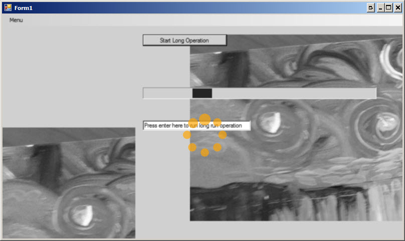
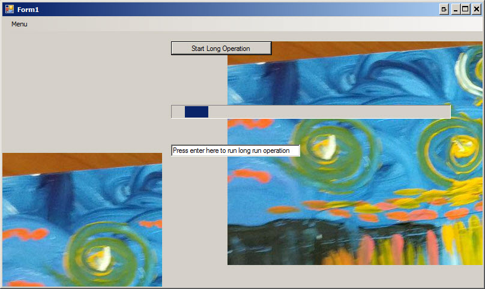

# LoadingIndicator

Winforms long operation indicator.

## Features:
* Stop keyboard/mouse action until operation complete
* Show loading indicator only if operation is really long (by default 700ms)
* If loading indicator is shown and operation is just completed, prolong this operation to minimum show indicator time (300ms by default) to awoid flickr
* When operation is really long greyscale and blur parent controls, display colorized loading indicator on top
* Ability to change color of loading indicator
* Ability to fully change indicator control

## Get Started:
```C#
private LongOperation _longOperation;

public MainForm()
{
   InitializeComponents();

   // Initialize long operation with control which will
   // be overlayed during long operations
   _longOperation = new LongOperation(this);

   // You can pass settings to customize indicator view/behavior
   // _longOperation = new LongOperation(this, LongOperationSettings.Default);
}

public async vod DoSomethingLongClick(object sender, EventArgs e)
{
    using(_longOperation.Start())
    {
        await DoSomethingLongAsync();
    }
}
```

## Screenshots:

Indicator shown:



Before:




